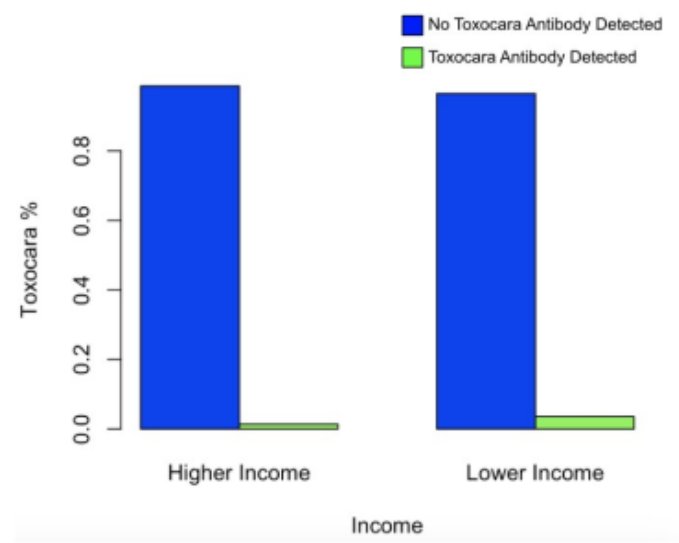

# Toxocariasis Prevalence Among Low-Income Children in the United States (2011-2012)

## Overview
This repository contains the analysis of Toxocariasis prevalence among children in the United States, focusing on income-related disparities. The study uses data from the 2011-2012 NHANES survey and examines the association between income levels and Toxocariasis antibody presence in children aged 6-19 years.

## Abstract

**Background**: Toxocariasis is a disease caused by parasitic roundworms transmitted via fecal matter, generally from canine and feline domestic pets. It has been referred to as the "neglected disease of poverty" in the United States, given its presence in fecal matter-contaminated parks and playground areas.

**Methods**: The NHANES Toxocariasis study is a cross-sectional study conducted from 2011-2012 to understand the relationship between multiple variables and Toxocariasis. This analysis examines the association between income levels and Toxocariasis in a subset of n=1,297 aged 6 to 19. A chi-square test was conducted with the prevalence difference, and a multivariable logistic regression analysis was used to obtain an adjusted odds ratio and 95% confidence interval.

**Results**: Overall, there were 30 (2.3%) cases of Toxocariasis among 1,297 participants aged 6-19 years in 2011-2012. The prevalence of Toxocariasis in the lower-income group was 3.5%, while in the higher-income group, it was 1.4%. There was a significant statistical difference in the computed prevalence difference (0.02) from the chi-squared test (test statistic = 6.76, 1 df, p = 0.009). In the adjusted analysis, there was no statistically significant difference between lower and higher income groups, controlling for log-transformed blood lead levels, age, race/ethnicity, and home ownership status (OR=0.377, 95% CI: 0.607, 3.638, p=0.405).

**Conclusion**: There is no evidence that income affected the risk of Toxocariasis among children aged 6-19 years in the United States in 2011-2012.

## Background

Toxocariasis is caused by a parasitic roundworm found in the intestines of dogs and cats. It is transmitted from animals to humans via canine and feline feces from domestic pets. Infections are often asymptomatic but can cause severe central nervous system complications or vision loss. Toxocariasis is considered a "neglected disease of poverty" in the United States (U.S.) due to contamination in parks in urban areas with fecal material. In some cases, individuals may be exposed to Toxocariasis via their pets.

This cross-sectional study of 1,297 participants was conducted from the 2011 to 2012 NHANES survey dataset. Participants are U.S. residents from 15 selected areas, per NHANES selection strategy, aged 6-19 years (NHANES - Participants - Why I Was Selected, 2021). The primary exposure assessed is income. To assess the income difference effect on Toxocariasis antibody presence, 'income' was modified to be dichotomous by grouping income groups 1-6 as 'lower-income' ($0 to $34,999), and groups 7-11 as 'higher-income,' ($35,000 to $75,000+).

Given the known association between poverty and Toxocariasis in the U.S., the null hypothesis is that income will not affect the prevalence of Toxocariasis in 2011-2012 NHANES participants aged 6 to 19 years (H₀: p₁=p₂). The research hypothesis is that there will be a positive effect (increased prevalence) of Toxocariasis in the lower-income group from the 2011-2012 NHANES study (H₁: p₁≠p₂).

## Methods

### Data Source
The study used the NHANES (National Health and Nutrition Examination Survey) 2011-2012 dataset. The analysis focused on a subset of 1,297 participants aged 6-19 years from 15 selected areas across the United States.

### Key Variables
- **Exposure**: Income level
  - Lower-income: $0 to $34,999 (income groups 1-6)
  - Higher-income: $35,000 to $75,000+ (income groups 7-11)
- **Outcome**: Toxocariasis antibody presence (binary: present/absent)
- **Covariates**: 
  - Log-transformed blood lead levels (continuous)
  - Age in months (continuous)
  - Race/ethnicity (categorical)
    1. Mexican American
    2. Other Hispanic
    3. Non-Hispanic White
    4. Non-Hispanic Black
    5. Other Race
  - Home ownership status (categorical)
    1. Owned/Being Bought
    2. Rented
    3. Other Arrangement

### Statistical Analysis
1. **Descriptive Analysis**:
   - Calculation of frequencies and percentages for categorical variables
   - Calculation of means, standard deviations, medians, and interquartile ranges for continuous variables
   - Cross-tabulation of participant characteristics by income group

2. **Bivariate Analysis**:
   - Chi-square test to assess the unadjusted association between income and Toxocariasis
   - Calculation of prevalence difference with 95% confidence interval

3. **Multivariable Analysis**:
   - Crude logistic regression model with income as the only predictor
   - Adjusted logistic regression model controlling for log-transformed blood lead levels, age, race/ethnicity, and home ownership status
   - Calculation of odds ratios, 95% confidence intervals, and p-values
   - Assessment of confounding magnitude

4. **Statistical Software**:
   - All analyses were conducted using R statistical software

## Results

### Descriptive Statistics

#### Participant Characteristics by Income Group

The study included 1,297 participants: 563 (43.4%) in the lower-income group and 734 (56.6%) in the higher-income group.

| Characteristic | Lower-Income (n=563) | Higher-Income (n=734) |
|----------------|----------------------|-----------------------|
| **Log-Transformed Blood Lead Level (µg/dL)** | -0.436 (0.640) | -0.693 (0.514) |
| **Age in months (Median, IQR)** | 130 (72.5) | 134 (78.0) |
| **Race/Ethnicity (n, %)** | | |
| Mexican American | 148 (26.3%) | 189 (25.7%) |
| Other Hispanic | 72 (12.8%) | 65 (8.9%) |
| Non-Hispanic White | 140 (24.9%) | 223 (30.4%) |
| Non-Hispanic Black | 154 (27.4%) | 121 (16.5%) |
| Other Race | 49 (8.7%) | 136 (18.5%) |
| **Home Ownership Status (n, %)** | | |
| Owned/Being Bought | 173 (30.7%) | 506 (68.9%) |
| Rented | 385 (68.4%) | 219 (29.8%) |
| Other Arrangement | 5 (0.9%) | 9 (1.2%) |

Notable differences between the income groups included:

1. **Blood Lead Levels**: Lower-income participants had higher average log-transformed blood lead levels (-0.436) compared to higher-income participants (-0.693).

2. **Race/Ethnicity**: The lower-income group had a higher proportion of Non-Hispanic Black participants (27.4% vs. 16.5%) and Other Hispanic participants (12.8% vs. 8.9%), while the higher-income group had more Non-Hispanic White participants (30.4% vs. 24.9%) and Other Race participants (18.5% vs. 8.7%).

3. **Home Ownership**: A stark difference in home ownership was observed, with 68.9% of higher-income participants owning homes compared to only 30.7% of lower-income participants. Conversely, 68.4% of lower-income participants rented their homes compared to 29.8% of higher-income participants.

#### Toxocariasis Prevalence

Overall, 30 cases (2.3%) of Toxocariasis were identified among the 1,297 participants.

| Income Group | Toxocariasis Cases | Total Participants | Prevalence |
|--------------|--------------------|--------------------|------------|
| Lower-income | 20 | 563 | 3.5% |
| Higher-income | 10 | 734 | 1.4% |
| **Overall** | **30** | **1,297** | **2.3%** |

The computed prevalence ratio was 2.61, meaning children aged 6-19 in the lower-income group in 2011-2012 had 2.61 times the prevalence of Toxocara antibodies than those in the higher-income group.



### Statistical Analysis

#### Chi-Square Test for Association Between Toxocariasis and Income

| Measure | Value | 95% CI | Test Statistic | p-value |
|---------|-------|--------|----------------|---------|
| Prevalence Difference | 0.022 (2.19 per 100) | (0.45, 3.93) per 100 | χ² = 6.76, df = 1 | 0.009 |

In the lower-income group, children aged 6-19 experienced 2.19 more cases of Toxocariasis per 100 than those in the higher-income group in 2011-2012 (95% CI: 0.45 per 100 to 3.93 per 100). This association was statistically significant (χ²=6.76, df=1, p=0.009).

#### Logistic Regression Analysis

A multivariable logistic regression analysis was conducted to account for potential confounding, including log-transformed blood lead levels, age, race/ethnicity, and home ownership status as covariates.

| Model | Odds Ratio | 95% CI | p-value |
|-------|------------|--------|---------|
| Crude (Unadjusted) | 2.67 | (1.27, 5.98) | 0.012 |
| Adjusted* | 0.38 | (0.61, 3.64) | 0.405 |

*Adjusted for log-transformed blood lead level, age, race/ethnicity, and home ownership status

#### Full Adjusted Model Results

| Variable | Estimate | Std. Error | z value | Pr(>&#124;z&#124;) |
|----------|----------|------------|---------|-----------------|
| (Intercept) | -5.185 | 0.808 | -6.420 | <0.001 |
| Low Income | 0.377 | 0.453 | 0.832 | 0.405 |
| Log Lead Level | 1.731 | 0.280 | 6.178 | <0.001 |
| Age | 0.012 | 0.004 | 2.928 | 0.003 |
| Race 1 vs. 3 | -0.534 | 0.608 | -0.879 | 0.380 |
| Race 2 vs. 3 | 1.022 | 0.548 | 1.865 | 0.062 |
| Race 4 vs. 3 | -0.266 | 0.572 | -0.466 | 0.641 |
| Race 5 vs. 3 | -1.702 | 1.099 | -1.550 | 0.121 |
| Home Status 2 vs. 1 | 0.015 | 0.451 | 0.033 | 0.974 |
| Home Status 3 vs. 1 | 1.599 | 1.147 | 1.394 | 0.163 |

The magnitude of confounding (calculated as (crude OR - adjusted OR) / adjusted OR) was 160.40%, which suggests substantial confounding was present in the crude association.

After adjustment, log-transformed blood lead level and age were the only significant predictors of Toxocariasis prevalence. Each unit increase in log-transformed blood lead level was associated with a 5.65-fold increase in the odds of Toxocariasis (OR=5.65, p<0.001).

## Discussion

### Key Findings

After adjusting for potential confounders, the analysis found no statistically significant association between income level and Toxocariasis prevalence among children aged 6-19 years in the United States in 2011-2012 (adjusted OR=0.38, 95% CI: 0.61-3.64, p=0.405). This stands in contrast to the unadjusted analysis, which showed a significant association (OR=2.67, 95% CI: 1.27-5.98, p=0.012).

The dramatic change in the odds ratio from the crude to the adjusted model (from 2.67 to 0.38) with a magnitude of confounding of 160.40% suggests that other factors strongly influenced the relationship between income and Toxocariasis. Particularly noteworthy was the strong association between log-transformed blood lead levels and Toxocariasis, which emerged as a significant predictor in the adjusted model.

### Potential Explanations for Findings

#### 1. Confounding Effects

The high degree of confounding (160.40%) suggests other factors strongly influenced the relationship between income and Toxocariasis. Key potential confounders include:

- **Blood Lead Levels**: The average log-transformed blood lead level differed substantially between income groups (-0.436 in the lower-income group vs. -0.693 in the higher-income group). Since blood lead level is indicative of exposure to lead, which is prevalent in poorer urban areas with older housing stock, it may be associated with both income level and Toxocariasis exposure risk. Lead exposure often occurs in similar environmental contexts as Toxocariasis exposure (degraded urban areas).

- **Home Ownership Status**: Lower-income individuals were much more likely to rent (68.4% vs. 29.8%), which may influence where they live. People who rent may be concentrated in lower-income areas with decreased economic mobility, affecting both income and exposure to environments with higher rates of fecal contamination from pets due to poor maintenance.

#### 2. Potential Biases

Several sources of bias may have influenced the results:

- **Selection Bias**: The dataset included more participants in the higher-income group (734) than the lower-income group (563). This unequal distribution might bias results toward or away from the null if participation differs by outcome status.

- **Misclassification of Exposure**: The income groupings used in this study were not stratified based on the Federal Poverty Line but rather created by grouping income categories 1-6 as "lower-income" and 7-11 as "higher-income." This approach may have resulted in the misclassification of some individuals as "lower-income" who would not be considered low-income by federal standards, potentially biasing the results away from the null and underestimating the true association between income and Toxocariasis.

#### 3. Limitations of Study Design

- **Cross-sectional Nature**: As with all cross-sectional studies, temporal sequence cannot be established. It's impossible to determine whether income level preceded Toxocariasis or vice versa.

- **Prevalent Cases**: The study captures prevalent rather than incident cases of Toxocariasis. Cases of long duration may be overrepresented, potentially biasing the results.

- **Single Time Point**: Analyzing data from a single time point (2011-2012) provides no information about trends over time, which might have revealed different patterns.

### Generalizability

The results of this cross-sectional study may be generalizable to similar populations of children in North America and some European countries, as they are comparable regarding soil conditions and animal contact opportunities (Abedi et al., 2021). However, caution should be exercised when generalizing to populations with different socioeconomic structures, pet ownership patterns, or environmental conditions.

## Public Health Implications

Despite the lack of a statistically significant association between income and Toxocariasis after adjustment, several important public health implications emerge from this study:

1. **Targeted Interventions**: The results suggest that public health interventions should target specific risk factors beyond income alone. Children in lower-income households who live in rental housing and have high blood lead levels may be more vulnerable to Toxocariasis exposure.

2. **Environmental Focus**: Since these children may be more likely to be exposed to animal feces in parks and playgrounds in their environments, policies targeting these environments are necessary. This might include increased sanitation measures, pet waste management programs, and regular maintenance of public spaces in vulnerable neighborhoods.

3. **Integrated Approach**: The strong association between blood lead levels and Toxocariasis suggests that public health efforts addressing environmental hazards should adopt an integrated approach. Programs targeting lead exposure might also incorporate Toxocariasis prevention measures.

4. **Education and Awareness**: Educational campaigns about proper pet care, regular deworming of pets, and hygiene practices could be particularly beneficial for populations at higher risk.

Chen et al. (2018) highlight the progressive public health impact of Toxocariasis and call for increased attention to this "silent threat." Our findings support the need for targeted interventions, particularly in environments where children may be at higher risk due to factors associated with, but not limited to, income level.

## Repository Structure

The repository is organized as follows:

```
Toxocariasis-Prevalence-Among-Low-Income-Children/
├── README.md                              # Project documentation
├── main.R                                 # Main script that orchestrates the analysis
├── 1_data_preparation.R                   # Data import and preparation
├── 2_descriptive_statistics.R             # Code for descriptive analysis
├── 3_statistical_analysis.R               # Statistical tests and regression models
├── 4_tables_figures.R                     # Generation of tables and figures
├── prevalence_toxocariasis_by_income_group.png  # Figure showing prevalence by income
├── project_report.pdf                     # Original project report
└── r code and output.txt                  # Original R code with outputs
```

### How to Run the Analysis

1. Ensure you have R installed (version 3.6.0 or higher recommended)
2. Download the dataset (`tox_lead11.21.csv`) - not included in repository
3. Run the main analysis script:
   ```
   source("main.R")
   ```

## References

1. Abedi, B., Akbari, M., KhodaShenas, S., Tabibzadeh, A., Abedi, A., Ghasemikhah, R., Soheili, M., Bayazidi, S., & Moradi, Y. (2021). The global prevalence of Toxocara spp. in pediatrics: A systematic review and meta-analysis. Clinical and Experimental Pediatrics, 64(11), 575–581. https://doi.org/10.3345/cep.2020.01039

2. Chen, J., Liu, Q., Liu, G.-H., Zheng, W.-B., Hong, S.-J., Sugiyama, H., Zhu, X.-Q., & Elsheikha, H. M. (2018). Toxocariasis: A silent threat with a progressive public health impact. Infectious Diseases of Poverty, 7(1), 59. https://doi.org/10.1186/s40249-018-0437-0

3. NHANES- Participants - Why I was selected. Published July 22, 2021. Accessed December 11, 2023. https://www.cdc.gov/nchs/nhanes/participant/participant-selected.htm

4. U.S. Department of Health and Human Services. (2011). 2011 HHS Poverty Guidelines. ASPE. Retrieved December 16, 2023, from https://aspe.hhs.gov/2011-hhs-poverty-guidelines

## Authors

Isabel Jacob, Ojasvi Pranav-Vachharajani, Emily Sharlach, and Miwa Watanabe
Boston University School of Public Health